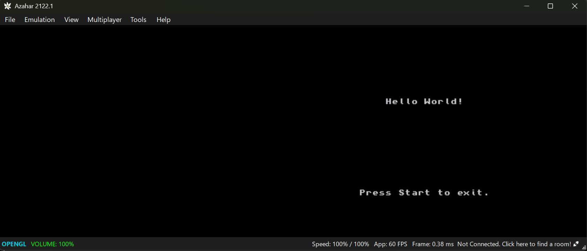

# Hello World!
## Goal
My Goal for this lab is to figure out how to print hello world to the screen using my current 3ds development tools and to get a FBI system working so I can easily test on my 3ds.

## Steps
1. I found an example code using libctru library on this website: [hello-world-example](https://github.com/devkitPro/3ds-examples/blob/a9aaa0c5fcc1e216c1aebd5395be0720a7dcb147/graphics/printing/hello-world/source/main.c#L4)

2. Solve the build issue in WSL. Found a interesting vscode template at [github](https://github.com/dwaaad/VS-Code-Template-for-3DS-Development?tab=readme-ov-file)

In terminal run:
```
nano ~/.bashrc
```
Add this to the bottom:
```~$ export DEVKITPRO=/opt/devkitpro
export DEVKITARM=$DEVKITPRO/devkitARM
export PATH=$PATH:$DEVKITARM/bin
```

```
ctrl+O to save
ctrl+X to exit
```

Then you can check if the variable is there with: 

```
echo $DEVKITARM
```

3. Fix include for ```<3ds>```
In vs code:
```
Ctrl + Shift + P
```
Type:
```
C/C++: Edit Configurations (JSON)
```

Paste this in the file that opens:
```
{
  "version": 4,
  "configurations": [
    {
      "name": "WSL-3DS",
      "compilerPath": "/opt/devkitpro/devkitARM/bin/arm-none-eabi-gcc",
      "intelliSenseMode": "linux-gcc-arm",
      "cStandard": "c17",
      "cppStandard": "c++20",
      "includePath": [
        "${workspaceFolder}/**",
        "/opt/devkitpro/libctru/include",
        "/opt/devkitpro/devkitARM/arm-none-eabi/include",
        "/opt/devkitpro/devkitARM/arm-none-eabi/include/c++/*",
        "/opt/devkitpro/devkitARM/arm-none-eabi/include/c++/*/arm-none-eabi"
      ],
      "defines": [
        "__3DS__"
      ]
    }
  ]
}

```

3. Code the hello world program: (I found test code at [github](https://github.com/dwaaad/VS-Code-Template-for-3DS-Development?tab=readme-ov-file))

    ```c++
    #include <3ds.h>
    #include <stdio.h>

    int main(int argc, char **argv)
    {
        gfxInitDefault();

        //Initialize console on top screen. Using NULL as the second argument tells the console library to use the internal console structure as current one
        consoleInit(GFX_TOP, NULL);

        //Move the cursor to row 15 and column 19 and then prints "Hello World!"
        //To move the cursor you have to print "\x1b[r;cH", where r and c are respectively the row and column where you want your cursor to move
        //The top screen has 30 rows and 50 columns
        //The bottom screen has 30 rows and 40 columns
        printf("\x1b[11;20HHello World!");

        printf("\x1b[25;16HPress Start to exit.");

        // Main loop
        while (aptMainLoop())
        {
            //Scan all the inputs. This should be done once for each frame
            hidScanInput();

            //hidKeysDown returns information about which buttons have been just pressed (and they weren't in the previous frame)
            u32 kDown = hidKeysDown();

            if (kDown & KEY_START) break; // break in order to return to hbmenu

            // Flush and swap framebuffers
            gfxFlushBuffers();
            gfxSwapBuffers();

            //Wait for VBlank
            gspWaitForVBlank();
        }

        gfxExit();
        return 0;
    }

    ```

4. Add the overall gamefolder to Azahar and scan for the subfolder containing the file after running ```make```.

5. It gives me this result: 

6. Create a CIA File and QR Code:

    To do this, I need to create a cia file, and doing some research, there is a tool called make rom to do that. I just need to install it. 

    - in terminal run, this will download the zip for makerom:

        ```
        wget -O makerom.zip "https://github.com/3DSGuy/Project_CTR/releases/download/makerom-v0.18.2/makerom-v0.18.2-ubuntu_x86_64.zip"
        ```

        ```
        unzip makerom.zip
        ```

        Move makerom to PATH
        ```
        sudo mv makerom /usr/local/bin/
        ```
        Need to install cxitool as well so move download from [this](https://www.gamebrew.org/wiki/CxiTool_3DS) to my debian install.
        ```
        7z x cxitool3ds.7z
        ```

        ```
        unzip 3dstools-cxi-stuff.zip
        ```
        
        ```
        ./autogen.sh
        ./configure
        make
        ```

        ```
        sudo mv cxitool /usr/local/bin/
        ```

        Then I make in my project folder:

        ```
        cxitool 3ds-hello-world.3dsx 3ds-hello-world.cxi
        ```

        I moved my files to the app folder, then I create the cia using makerom:

        ```
        makerom -v -f cia -o 3ds-hello-world.cia -target t -i 3ds-hello-world.cxi:0:0 -ignoresign -icon 3ds-hello-world.smdh
        ```
